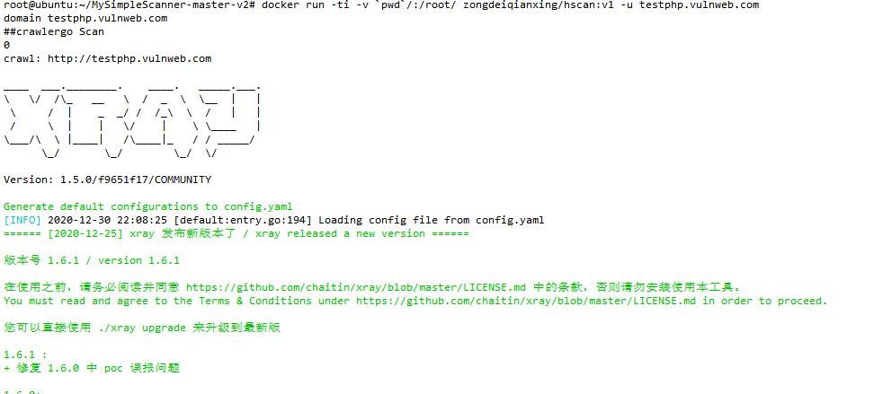
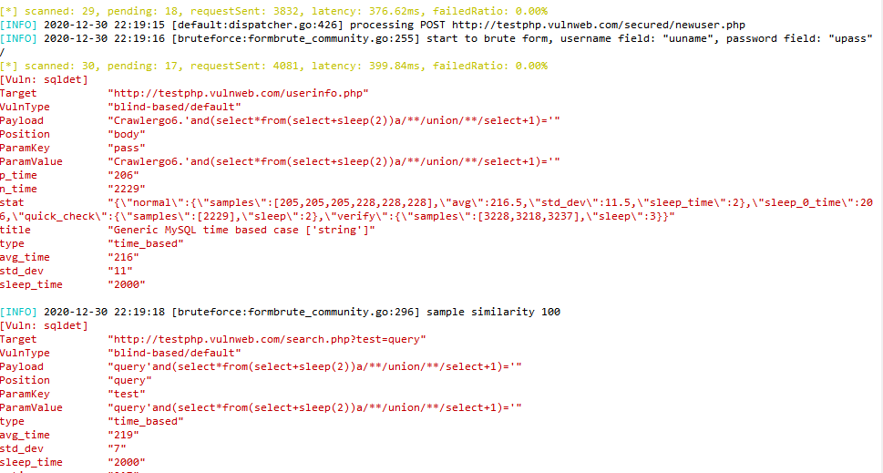
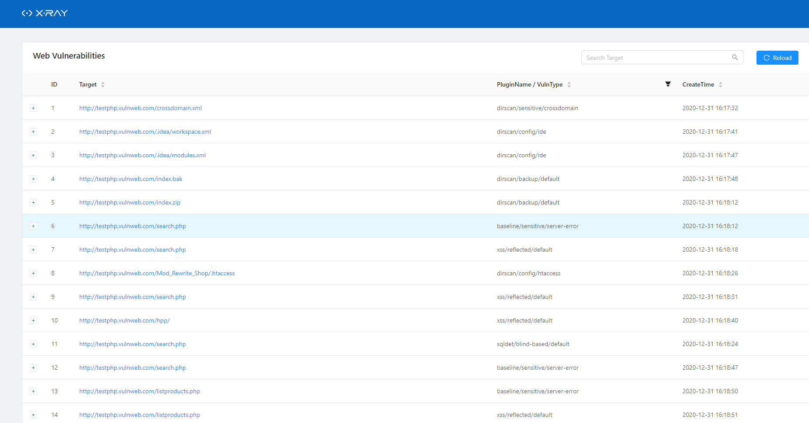
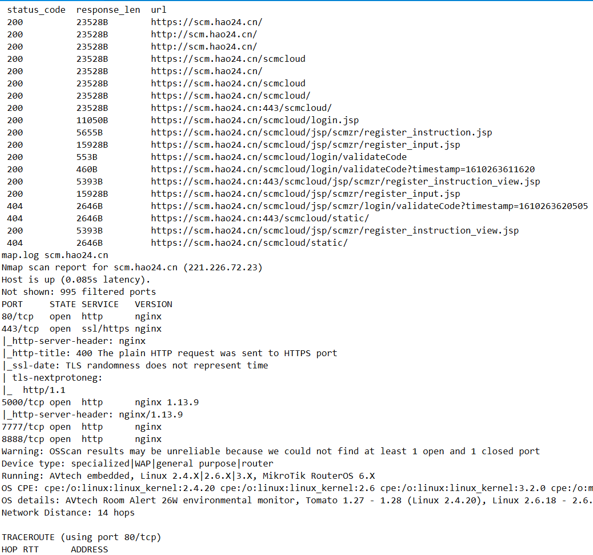

### 0x01 hscan介绍
#### hscan是什么
hscan是一款旨在使用一条命令替代渗透前的多条扫描命令，通过集成crawlergo扫描和xray扫描、dirsearch、nmap、jsfinder、nikto等工具，并使用-u \ -f  \ -d 等参数进行扫描目标方式的管理，最后利用docker安装完相关依赖进行封装，形成一款docker参数化扫描的工具。  
使用-d参数时输入域名，脚本自动使用oneforall遍历子域名并传入扫描

#### hscan做了哪些
 - 使用docker封装，使用参数运行
 - 使用crawlergo爬取网接，传给xray扫描
 - 使用dirsearch遍历目录及文件，传给xray扫描
 - 集成jsfinder、nmap、nikto等工具，可拓展
 - 增加xray扫描结束判断，避免实测中流量多大引起xray漏洞报告数量严重缺失
 - 增加-u url扫描/ -f 文件/ -d 域名的扫描入口方式
 - 集成crawlergo所需的浏览器 / chrome
 - 集成所有脚本所需的依赖包
 - 根据域名及扫描时间命名xray扫描报告
 - ...
 
 本来意欲所有工具多线程并发走，但是后来发现多线程流量大了xray扫描出的漏洞结果严重缺失，所以又控制了扫描频度
 
#### hscan流程图


### 0x02 hscan使用

#### 1 拉取代码并build镜像
```
git clone https://github.com/zongdeiqianxing/hscan.git
docker build -t hscan .
```
#### 2 在目录下执行命令，或直接执行docker_run.sh
```
docker run -ti --rm -v `pwd`/:/root/ hscan:latest -u testphp.vulnweb.com
```
其中：
```
Usage:
    python3 recon.py -u url 
    python3 recon.py -f filename        #-f参数使用时，为每行正则匹配域名，已测试的可适配OneforAll、subDoaminBrute的outut文件；手写域名进入也可；
    python3 recon.py -d domain          #-d参数使用时，输入主域名，自动使用OneForAll工具查找所有子域名，后自动使用Scan模块扫描。
```

#### 3 扫描完毕后需要手动多按几次`ctrl c`退出，之后即可在目录下看到html文件和url文件，其中html文件为xray扫描输出，url文件为其他工具的扫描输出






